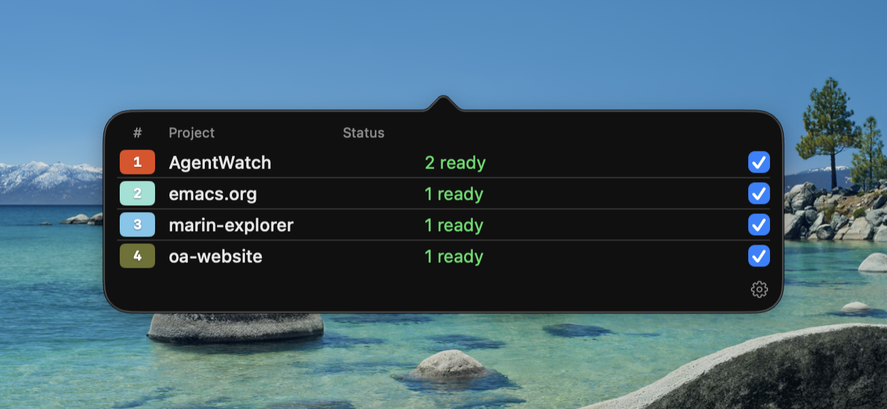
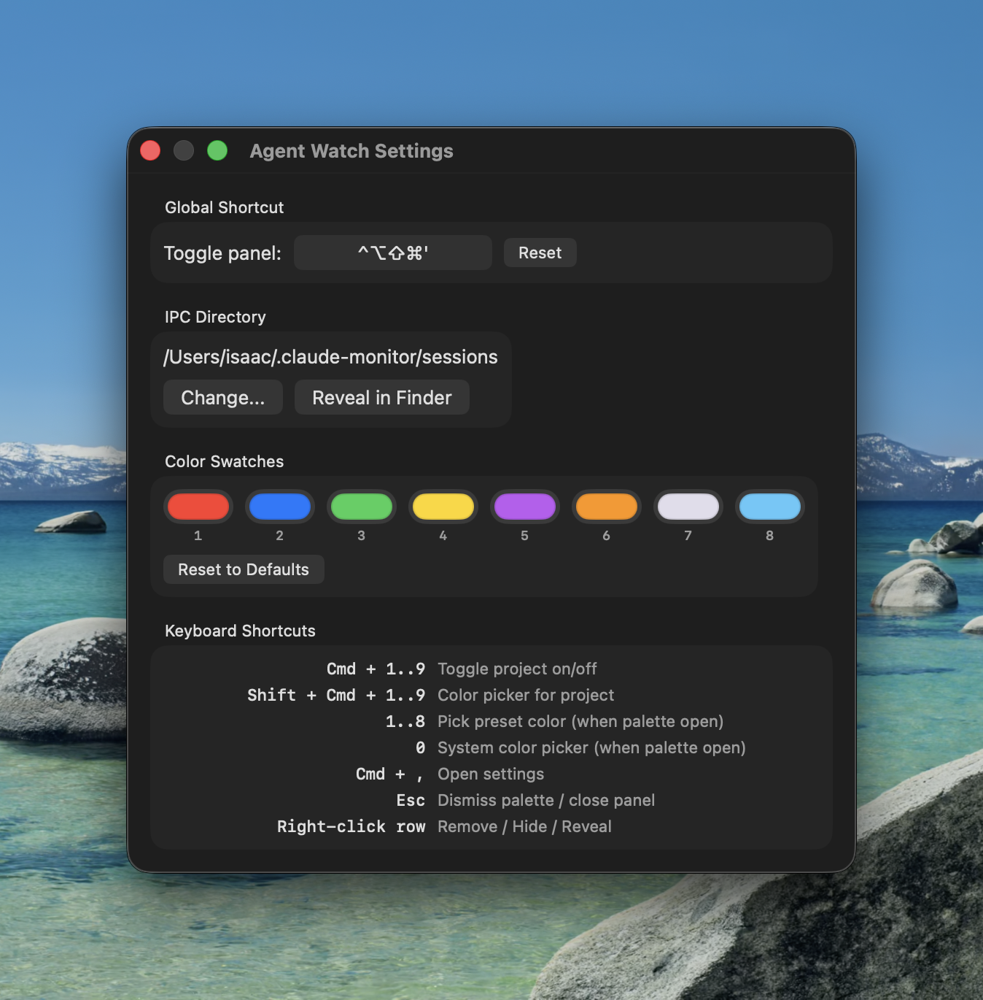

# Agent Watch

macOS menubar app that monitors [Claude Code](https://claude.ai/claude-code) sessions and displays per-project status as a hexagon cluster.


Each hexagon represents a project with active Claude Code sessions. Filled hexagons mean a session is **ready** (waiting for input). Outlined hexagons mean all sessions are **running**.

## How it works

```
Claude Code hooks  -->  ~/.claude-monitor/sessions/*.json  -->  Agent Watch (menubar app)
     (shell script)           (per-session files)                (FSEvents watcher)
```

Claude Code [hooks](https://docs.anthropic.com/en/docs/claude-code/hooks) write per-session JSON files to a watched directory. Agent Watch reads them, groups by project (git root basename), and renders a hex cluster in the menubar.

- **`UserPromptSubmit`** hook sets status to `running` the instant you hit enter
- **`Stop`** hook sets status to `idle` when Claude finishes responding
- **`SessionEnd`** hook removes the session file when you exit

## Screenshots

| Panel | Settings |
|-------|----------|
|  |  |

## Quick install

```bash
git clone https://github.com/ihodes/cc-agent-watch.git
cd cc-agent-watch
bash install.sh
```

This installs the hook script, merges hooks into your Claude Code settings, builds the app, and sets it up as a launch agent that starts on login.

## Manual setup

### 1. Install the hook script

```bash
mkdir -p ~/.claude-monitor
cp update-state.sh ~/.claude-monitor/
chmod +x ~/.claude-monitor/update-state.sh
```

Requires `jq` (`brew install jq`).

### 2. Add hooks to Claude Code

Merge the contents of `hooks-config.json` into your `~/.claude/settings.json`:

```json
{
  "hooks": {
    "UserPromptSubmit": [
      { "matcher": "", "hooks": [{ "type": "command", "command": "$HOME/.claude-monitor/update-state.sh running" }] }
    ],
    "Stop": [
      { "matcher": "", "hooks": [{ "type": "command", "command": "$HOME/.claude-monitor/update-state.sh idle" }] }
    ],
    "SessionStart": [
      { "matcher": "", "hooks": [{ "type": "command", "command": "$HOME/.claude-monitor/update-state.sh started" }] }
    ],
    "SessionEnd": [
      { "matcher": "", "hooks": [{ "type": "command", "command": "$HOME/.claude-monitor/update-state.sh ended" }] }
    ]
  }
}
```

### 3. Build and run

```bash
swift build
swift run AgentWatch
```

Requires Swift 6.2+ and macOS 26 (Tahoe). On first launch, macOS will prompt for Accessibility permission (for the global hotkey).

## Keyboard shortcuts

| Shortcut | Action |
|----------|--------|
| `Ctrl+Option+Shift+Cmd+'` | Toggle panel (global, configurable) |
| `Cmd+1..9` | Toggle project on/off |
| `Shift+Cmd+1..9` | Open color picker for project |
| `1..8` | Pick preset color (when palette is open) |
| `0` | System color picker (when palette is open) |
| `Cmd+,` | Open settings |
| `Esc` | Dismiss color palette |
| Right-click row | Remove / Hide / Reveal in Finder |

## Features

- **Hex cluster menubar icon** -- one hexagon per project, honeycomb layout, fills when ready
- **Per-project colors** -- 8 presets matching Claude Code's `/color` options, plus system picker
- **Multiple sessions** -- shows `"1 ready / 2 running"` when a project has mixed states
- **Stale detection** -- sessions stuck in `running` for >5 min are flagged; auto-cleaned after 10 min
- **`.agent-config.yaml`** -- if this file exists at a project's git root with `color: "#hex"`, Agent Watch reads it and keeps it in sync when you change colors in the UI
- **Hide/remove projects** -- right-click to hide (persists across restarts) or remove (reappears if hooks fire again)
- **Configurable global hotkey** -- change it in Settings
- **Customizable color swatches** -- edit the 8 preset colors in Settings

## Running tests

```bash
# Shell hook tests
bash test-hook-script.sh

# Swift tests
swift run AgentWatchTests
```

## Project structure

```
AgentWatch/
  update-state.sh              # Hook script (install to ~/.claude-monitor/)
  test-hook-script.sh           # Shell tests for the hook script
  hooks-config.json             # Hook config for manual merge into settings.json
  Package.swift                 # SPM package
  Sources/
    App/AgentWatchApp.swift     # Entry point, NSStatusItem + NSPopover
    Models/
      Session.swift             # Codable struct matching session JSON
      ProjectState.swift        # Aggregated project state
      AppState.swift            # @Observable app state, file loading, settings
    Views/
      HexClusterView.swift      # Menubar hex cluster rendering
      ConfigWindow.swift        # Popover panel + settings window
      ProjectRowView.swift      # Single project row with context menu
    Services/
      DirectoryWatcher.swift    # FSEvents directory watcher
      HotkeyManager.swift       # Global hotkey via HotKey library
    Utilities/
      HexLayout.swift           # Honeycomb position calculations
      ColorHex.swift            # Color <-> hex string conversion
  Tests/
    TestRunner.swift            # Standalone test harness
    SessionTests.swift          # JSON parsing, staleness
    ProjectStateTests.swift     # Aggregation logic
    HexLayoutTests.swift        # Layout geometry
    AppStateTests.swift         # Integration tests
```
